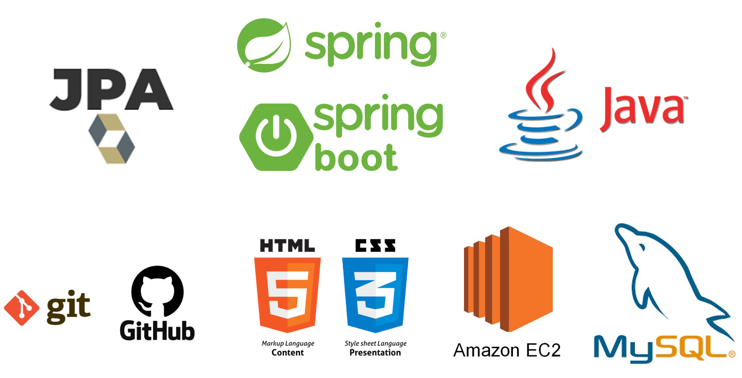
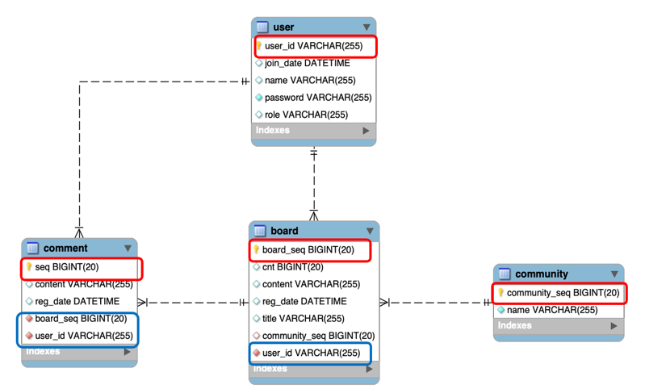
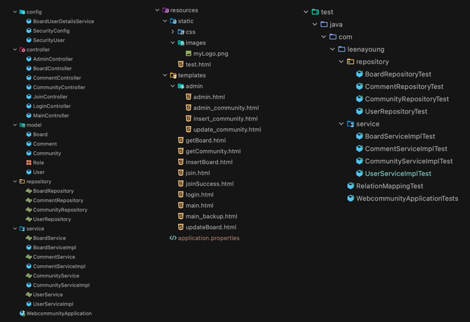

# 웹 커뮤니티

## 진행 과정

### 프로젝트 기간
2020년 12월 14일 ~ 18일 (총 5일)

- 12월 14일
    - 프로젝트 기획
    - DB 설계
    - 프로젝트 구조 설계
- 12월 15일
    - 메인 페이지
    - 로그인
    - 커뮤니티 탭
- 12월 16일
    - 회원가입
    - 글 상세보기
    - 글 쓰기, 수정하기
    - 검색 기능
- 12월 17일
    - 관리제 페이지
    - 게시판 페이징 처리
    - 웹 디자인
- 12월 18일
    - 마무리
    
## 웹 기획
- 목적 및 내용
    - 웹 커뮤니티 개발을 통한 MVC 모델 학습
    - 자바 백엔드 구현
    
## 사용 기술

## DB 구조

## 프로젝트 구조
